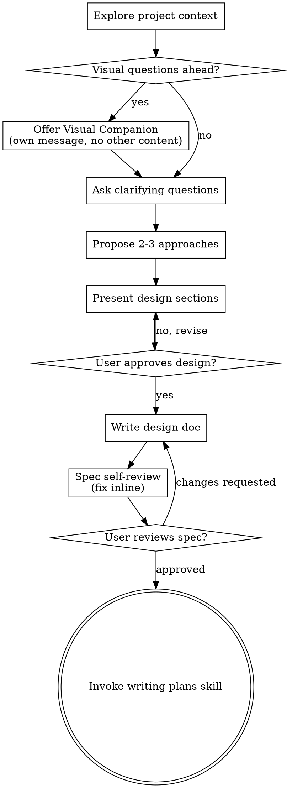

# Brainstorming Ideas Into Designs

Help turn ideas into fully formed designs and specs through natural collaborative dialogue.

Start by understanding the current project context, then ask questions one at a time to refine the idea. Once you understand what you're building, present the design and get user approval.

<HARD-GATE>
Do NOT invoke any implementation skill, write any code, scaffold any project, or take any implementation action until you have presented a design and the user has approved it. This applies to EVERY project regardless of perceived simplicity.
</HARD-GATE>

**You MUST NOT call `EnterPlanMode` or `ExitPlanMode` during this skill.** This skill operates in normal mode. Plan mode restricts Write/Edit tools and has no clean exit. Use the writing-plans skill for structured planning instead.

## Anti-Pattern: "This Is Too Simple To Need A Design"

Every project goes through this process. A todo list, a single-function utility, a config change — all of them. "Simple" projects are where unexamined assumptions cause the most wasted work. The design can be short (a few sentences for truly simple projects), but you MUST present it and get approval.

## Auto-file Mode (standalone invocations)

Brainstorming runs in two contexts. **Step 0 below decides which, before anything else.** When dispatched as the `design` stage of the work pipeline, a work item already exists — behave exactly as today. When invoked standalone, auto-file a work item so the design enters the tracked pipeline instead of leaking outside it.

### Step 0 — Mode check (run FIRST, before "Explore project context")

Decide the mode purely from your dispatch brief — a doc check, no new tooling:

- **A work item already exists** when the brief contains a work-item brief (a title / kind / summary block) **or** the line *"STOP after writing the spec — do not invoke writing-plans."* These are the canonical "work item exists" signals the `graph-wiki:workflow` skill prepends when it dispatches the `design` stage.
  → **Skip auto-file entirely.** Run the legacy flow (Checklist steps 1-9) unchanged. Do **not** file a work item. Ignore the rest of this section.
- **Standalone** when neither signal is present.
  → **Enter auto-file mode:** perform Steps 2a, 3a, and 4a below in addition to the normal flow.

### Step 2a — Early stub + one quick confirm (auto-file mode only)

After "Explore project context" (Checklist step 1) and before asking clarifying questions, derive a proposed **title / kind / summary** from the opening request and present them in a single confirm:

> "I'll track this as a work item — **title** / **kind** / **summary**. Good, or adjust? (or say 'don't file')"

This one confirm does two things:

- **Locks the title**, from which `gw work file` derives the **permanent slug**. Slugs never change when the title is edited later, so the title is confirmed here — where it is decided — not at finalize.
- **Is the opt-out.** If the user says "don't file", skip auto-file and run the legacy standalone flow (chain into `writing-plans` at the end; nothing tracked).

On confirm, file the item and capture the slug from the JSON result:

```bash
gw work file --json --title "<title>" --kind <kind> --summary "<summary>"
```

Read the `slug` field from the JSON. Announce: *"Auto-filed as `<slug>`."* Then continue the normal brainstorming flow (clarifying questions → approaches → design) unchanged.

**Error fallback:** if `gw work file` fails (e.g. duplicate slug, validation error), report the error and fall back to plain brainstorming with no work item. Do not block the session.

### Step 3a — Finalize at spec time (auto-file mode only)

When the design is approved and you are about to write the spec (Checklist step 6), **before** writing it:

1. **Refine the item's frontmatter** from the now-complete design — `summary`, `affects`, and `effort`. There is no `gw work edit` command: edit `<workspace>/wiki/work/<slug>.md` directly. Derive the values and announce them — no second confirm. Set `effort` here so `/graph-wiki:next` is not later blocked waiting for it.
2. **Write the spec to the item's path:** `<workspace>/raw/specs/<slug>.md` (not the default `YYYY-MM-DD-<topic>-design.md` name), so the stamped `spec_doc` pointer and the ingestor line up.
3. **Advance the item:** `gw work advance <slug>`. This is the same design-complete transition the `workflow` skill applies — it stamps `spec_doc` and moves the phase `design → plan`.

**Error fallback:** if `gw work advance` fails, report it. The spec is already at `raw/specs/<slug>.md`, so the user can recover with `/graph-wiki:next <slug>`.

### Step 4a — Terminal behavior (auto-file mode only)

Once auto-filed, brainstorming follows pipeline rules: **STOP after the spec — do not invoke `writing-plans`.** End with the pipeline hand-off line:

> "Phase advanced to `plan`. Clear context (`/clear`) and run `/graph-wiki:next <slug>` to continue."

## Checklist

You MUST create a task for each of these items and complete them in order:

0. **Mode check** — standalone or pipeline-dispatched? (see Auto-file Mode → Step 0). Determines whether the auto-file deltas on steps 1, 6, and 9 apply.
1. **Explore project context** — check files, docs, recent commits
   - **(auto-file mode only)** then run the early-stub confirm and `gw work file --json` (Auto-file Mode → Step 2a)
2. **Offer visual companion** (if topic will involve visual questions) — this is its own message, not combined with a clarifying question. See the Visual Companion section below.
3. **Ask clarifying questions** — one at a time, understand purpose/constraints/success criteria
4. **Propose 2-3 approaches** — with trade-offs and your recommendation
5. **Present design** — in sections scaled to their complexity, get user approval after each section
6. **Write design doc** — save to the graph-wiki workspace spec inbox: `<workspace>/raw/specs/YYYY-MM-DD-<topic>-design.md`. The workspace doc-routing hook injects the resolved absolute path into your context — use it if present. Then commit.
   - **(auto-file mode only)** instead refine the item's frontmatter, write the spec to `<workspace>/raw/specs/<slug>.md`, and run `gw work advance <slug>` (Auto-file Mode → Step 3a)
7. **Spec self-review** — quick inline check for placeholders, contradictions, ambiguity, scope (see below)
8. **User reviews written spec** — ask user to review the spec file before proceeding
9. **Transition to implementation** — invoke writing-plans skill to create implementation plan
   - **(auto-file mode OR pipeline-dispatched)** do NOT invoke writing-plans; STOP after the spec and emit the pipeline hand-off line (Auto-file Mode → Step 4a)

## Process Flow



**The terminal state is invoking writing-plans** — *except* in auto-file mode or when pipeline-dispatched, where the terminal state is writing the spec and emitting the `/graph-wiki:next` hand-off line (see Auto-file Mode → Step 4a). Otherwise: do NOT invoke frontend-design, mcp-builder, or any other implementation skill. The ONLY skill you invoke after brainstorming is writing-plans.

## The Process

**Understanding the idea:**

- Check out the current project state first (files, docs, recent commits)
- Before asking detailed questions, assess scope: if the request describes multiple independent subsystems (e.g., "build a platform with chat, file storage, billing, and analytics"), flag this immediately. Don't spend questions refining details of a project that needs to be decomposed first.
- If the project is too large for a single spec, help the user decompose into sub-projects: what are the independent pieces, how do they relate, what order should they be built? Then brainstorm the first sub-project through the normal design flow. Each sub-project gets its own spec → plan → implementation cycle.
- For appropriately-scoped projects, ask questions one at a time to refine the idea
- Prefer multiple choice questions when possible, but open-ended is fine too
- Only one question per message - if a topic needs more exploration, break it into multiple questions
- Focus on understanding: purpose, constraints, success criteria

**Exploring approaches:**

- Propose 2-3 different approaches with trade-offs
- Present options conversationally with your recommendation and reasoning
- Lead with your recommended option and explain why

**Presenting the design:**

- Once you believe you understand what you're building, present the design
- Scale each section to its complexity: a few sentences if straightforward, up to 200-300 words if nuanced
- Ask after each section whether it looks right so far
- Cover: architecture, components, data flow, error handling, testing
- Be ready to go back and clarify if something doesn't make sense

**Design for isolation and clarity:**

- Break the system into smaller units that each have one clear purpose, communicate through well-defined interfaces, and can be understood and tested independently
- For each unit, you should be able to answer: what does it do, how do you use it, and what does it depend on?
- Can someone understand what a unit does without reading its internals? Can you change the internals without breaking consumers? If not, the boundaries need work.
- Smaller, well-bounded units are also easier for you to work with - you reason better about code you can hold in context at once, and your edits are more reliable when files are focused. When a file grows large, that's often a signal that it's doing too much.

**Working in existing codebases:**

- Explore the current structure before proposing changes. Follow existing patterns.
- Where existing code has problems that affect the work (e.g., a file that's grown too large, unclear boundaries, tangled responsibilities), include targeted improvements as part of the design - the way a good developer improves code they're working in.
- Don't propose unrelated refactoring. Stay focused on what serves the current goal.

## After the Design

**Documentation:**

- Write the validated design (spec) to the graph-wiki workspace spec inbox: `<workspace>/raw/specs/YYYY-MM-DD-<topic>-design.md`. The workspace doc-routing hook injects the resolved absolute path into your context — use it if present)
  - (User preferences for spec location override this default)
- Use elements-of-style:writing-clearly-and-concisely skill if available
- Commit the design document to git

**Spec Self-Review:**
After writing the spec document, look at it with fresh eyes:

1. **Placeholder scan:** Any "TBD", "TODO", incomplete sections, or vague requirements? Fix them.
2. **Internal consistency:** Do any sections contradict each other? Does the architecture match the feature descriptions?
3. **Scope check:** Is this focused enough for a single implementation plan, or does it need decomposition?
4. **Ambiguity check:** Could any requirement be interpreted two different ways? If so, pick one and make it explicit.

Fix any issues inline. No need to re-review — just fix and move on.

**User Review Gate:**
After the spec review loop passes, ask the user to review the written spec before proceeding:

> "Spec written and committed to `<path>`. Please review it and let me know if you want to make any changes before we start writing out the implementation plan."

Wait for the user's response. If they request changes, make them and re-run the spec review loop. Only proceed once the user approves.

**Implementation:**

**Pipeline-stage guard — check FIRST.** STOP after writing the spec — do **not** invoke `writing-plans` — in EITHER of these cases:

- **Pipeline-dispatched:** your dispatch brief contains the line *"STOP after writing the spec — do not invoke writing-plans"* (you are the `design` stage). Control returns to the `graph-wiki:workflow` skill, which advances the item and hands off for `/clear` + `/graph-wiki:next`.
- **Auto-filed:** you entered auto-file mode (see Auto-file Mode) and ran `gw work advance <slug>`. You own the hand-off — emit the pipeline hand-off line yourself (Auto-file Mode → Step 4a).

In both cases end with the hand-off line and do not chain into `writing-plans`.

**Only when standalone AND the user opted out** with "don't file" (untracked, legacy flow):

- Invoke the writing-plans skill to create a detailed implementation plan
- Do NOT invoke any other skill. writing-plans is the next step.

## Key Principles

- **One question at a time** - Don't overwhelm with multiple questions
- **Multiple choice preferred** - Easier to answer than open-ended when possible
- **YAGNI ruthlessly** - Remove unnecessary features from all designs
- **Explore alternatives** - Always propose 2-3 approaches before settling
- **Incremental validation** - Present design, get approval before moving on
- **Be flexible** - Go back and clarify when something doesn't make sense

## Visual Companion

A browser-based companion for showing mockups, diagrams, and visual options during brainstorming. Available as a tool — not a mode. Accepting the companion means it's available for questions that benefit from visual treatment; it does NOT mean every question goes through the browser.

**Offering the companion:** When you anticipate that upcoming questions will involve visual content (mockups, layouts, diagrams), offer it once for consent:
> "Some of what we're working on might be easier to explain if I can show it to you in a web browser. I can put together mockups, diagrams, comparisons, and other visuals as we go. This feature is still new and can be token-intensive. Want to try it? (Requires opening a local URL)"

**This offer MUST be its own message.** Do not combine it with clarifying questions, context summaries, or any other content. The message should contain ONLY the offer above and nothing else. Wait for the user's response before continuing. If they decline, proceed with text-only brainstorming.

**Per-question decision:** Even after the user accepts, decide FOR EACH QUESTION whether to use the browser or the terminal. The test: **would the user understand this better by seeing it than reading it?**

- **Use the browser** for content that IS visual — mockups, wireframes, layout comparisons, architecture diagrams, side-by-side visual designs
- **Use the terminal** for content that is text — requirements questions, conceptual choices, tradeoff lists, A/B/C/D text options, scope decisions

A question about a UI topic is not automatically a visual question. "What does personality mean in this context?" is a conceptual question — use the terminal. "Which wizard layout works better?" is a visual question — use the browser.

If they agree to the companion, read the detailed guide before proceeding:
`skills/brainstorming/visual-companion.md`

---

## Native Task Integration

**REQUIRED:** Use Claude Code's native task tools to create structured tasks during design.

### During Design Validation

After each design section is validated, create a task with structured description:

```yaml
TaskCreate:
  subject: "Implement [Component Name]"
  description: |
    **Goal:** [What this component produces]

    **Files:**
    - Create/Modify: [paths identified during design]

    **Acceptance Criteria:**
    - [ ] [Criterion from design validation]
    - [ ] [Criterion from design validation]

    **Verify:** [How to test this component works]

    ```json:metadata
    {"files": ["path/from/design"], "acceptanceCriteria": ["criterion 1", "criterion 2"]}
    ```
  activeForm: "Implementing [Component Name]"
```

These tasks will be refined with steps and verify commands during plan writing. See `skills/shared/task-format-reference.md` for the full format.

Track all task IDs for dependency setup.

### After All Components Validated

Set up dependency relationships:

```yaml
TaskUpdate:
  taskId: [dependent-task-id]
  addBlockedBy: [prerequisite-task-ids]
```

### Before Handoff

Run `TaskList` to display the complete task structure with dependencies.
